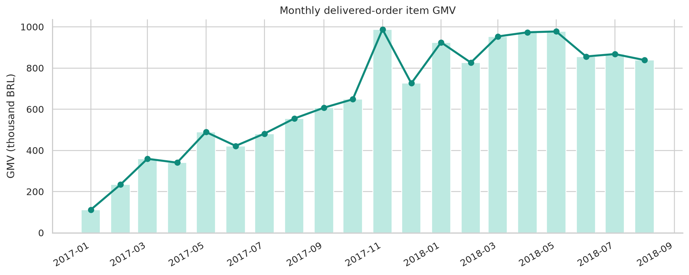
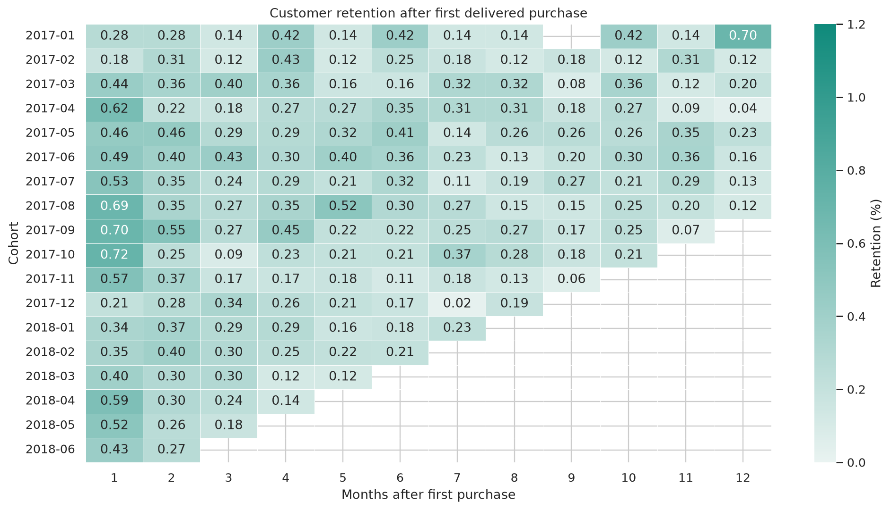
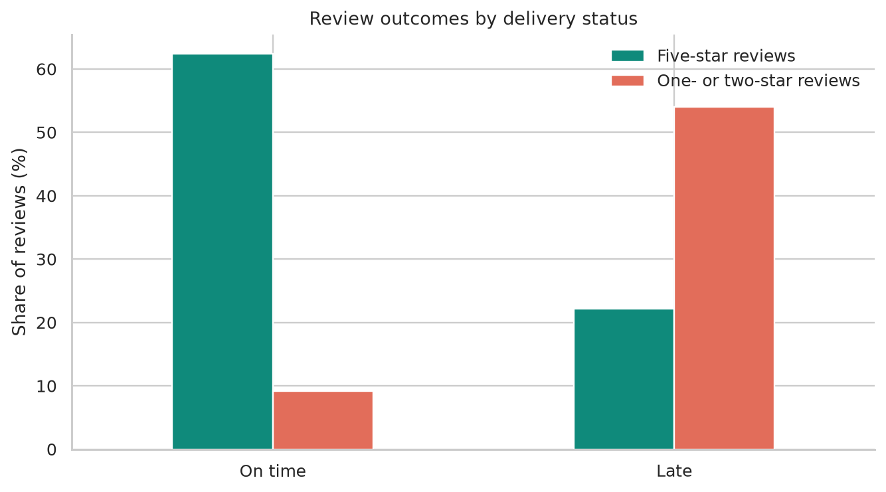

# 04 · E-commerce Revenue & Cohort Analysis

## Business question

Where is marketplace sales value growing, how many customers return after
their first purchase, and how is delivery performance associated with customer
reviews?

**Stakeholders:** marketplace growth, operations, and customer-experience teams.

## Why this project exists

The first three portfolio projects emphasize Python modeling and statistics.
This project demonstrates a different data-analyst skill set:

- multi-table SQL;
- explicit fact-table grain;
- data-quality checks;
- cohort retention;
- operational KPI design;
- dashboard-ready output tables.

## Data

The project uses the real, anonymized **Brazilian E-Commerce Public Dataset by
Olist**: approximately 100,000 orders across customers, orders, items,
payments, reviews, products, and sellers. See [DATA_SOURCE.md](DATA_SOURCE.md)
for attribution, license, and limitations.

Raw data are excluded from Git. Small aggregated outputs are committed so the
public Streamlit summary and standalone Plotly Dash command center start
quickly without downloading 43 MB on every cold start.

## Warehouse design

```text
raw_customers ──┐
raw_items ──────┼─> order-level rollups ─> order_mart (one row per order)
raw_payments ───┤
raw_reviews ────┘
raw_products ─────> order_category_mart (one row per order/category)
```

The key protection against double counting is in `sql/01_marts.sql`: items,
payments, and reviews are each aggregated to `order_id` before joining. A raw
items-to-payments join would multiply rows and inflate marketplace value.

## SQL analyses

| File | Purpose |
|---|---|
| `00_create_tables.sql` | Load typed CSV tables into DuckDB |
| `01_marts.sql` | Build safe order and order-category grains |
| `02_executive_kpis.sql` | Delivered orders, GMV, AOV, repeat rate, delivery and reviews |
| `03_monthly_performance.sql` | Monthly value, customers, growth, delivery and experience |
| `04_cohort_retention.sql` | First-purchase cohorts and monthly retention |
| `05_delivery_by_state.sql` | State-level value and delivery performance |
| `06_delivery_experience.sql` | On-time versus late review outcomes |
| `07_category_performance.sql` | Category value, volume, delivery, and ratings |
| `08_data_quality.sql` | Key, orphan, price, and date checks |

## Application delivery

Project 04 intentionally uses two delivery layers:

1. `pages/4_Ecommerce_SQL.py` is the concise project summary inside the main
   Streamlit portfolio.
2. `ecommerce_dash_app.py` is the standalone Plotly Dash command center with
   callback-driven filters, five analytical views, SQL inspection, quality
   evidence, and an exportable executive brief.

The app does not claim unsupported multidimensional filtering. The date,
state, and category controls update the monthly, state, and category outputs
at their actual committed grains.

Run the standalone app from the repository root:

```powershell
python ecommerce_dash_app.py
```

Then open `http://127.0.0.1:8050`. See [DEPLOYMENT.md](DEPLOYMENT.md) for the
free Plotly Cloud publication workflow.

## Reproduce from raw data

From the repository root in Windows PowerShell:

```powershell
python .\04-ecommerce-sql\download_data.py
python .\04-ecommerce-sql\build_warehouse.py
python .\04-ecommerce-sql\run_analysis.py
python .\04-ecommerce-sql\render_assets.py
python -m pytest -q
python -m streamlit run streamlit_app.py
python ecommerce_dash_app.py
```

The first command downloads approximately 43 MB. No paid service is required.

## Key findings

- 96,478 delivered orders generated **R$13.22M in item GMV** at an average of **R$137.04 per delivered order**.
- Only **3.0% of customers** placed at least two delivered orders in the observation window; weighted month-one cohort retention was approximately **0.48%**.
- On-time deliveries averaged **4.29 stars**, versus **2.57** for late deliveries. Low reviews occurred on **54.0% of late deliveries** and **9.2% of on-time deliveries**.
- November 2017 had the highest complete-month GMV (**R$987.8K**) while on-time delivery fell to **85.7%**.
- Health and beauty led categories with **R$1.23M** in delivered-order item GMV.

See [insights.md](insights.md) for the action-oriented stakeholder brief.







## Interview discussion points

1. **Why DuckDB?** It runs analytical SQL locally with no server, reads CSV
   efficiently, and makes the project reproducible for reviewers.
2. **How was double counting prevented?** Every one-to-many table is rolled up
   to the intended join grain before the mart is built.
3. **Why call it GMV rather than revenue?** Item-price totals represent
   marketplace transaction value, not Olist's recognized revenue or margin.
4. **What is the largest limitation?** The observation window is historical
   and short for repeat-purchase behavior; retention is descriptive, not a
   causal estimate.
5. **What would come next?** Add contribution margin, acquisition channel,
   support contacts, and an intervention test around delivery promises.
