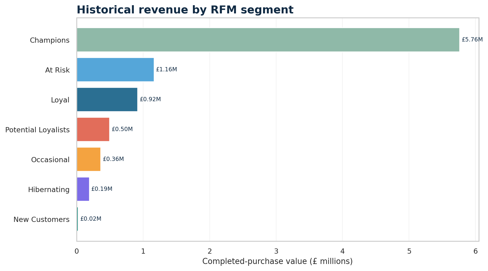
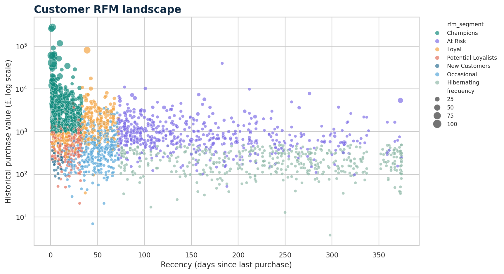
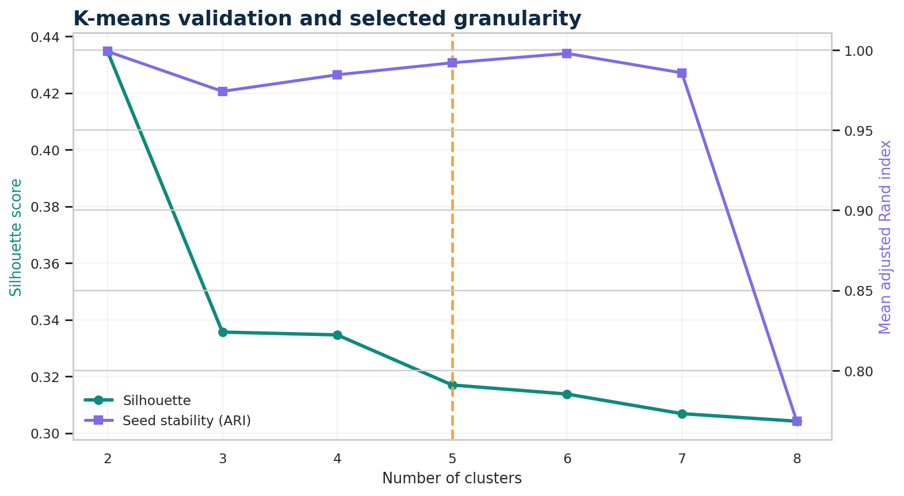

# 05 · Customer Segmentation & Marketing Dashboard

## Business question

How should the marketing team prioritize customer audiences for protection,
growth, reactivation, and suppression—and how should each campaign be
measured so historical customer value is not mistaken for causal impact?

**Stakeholders:** CRM, lifecycle marketing, commercial analytics, and finance.

## Why this project exists

This project completes the portfolio with a practical segmentation workflow:

- customer-grain feature engineering from transaction lines;
- transparent RFM rules as the activation baseline;
- K-means as a validated challenger model;
- campaign objectives, treatments, channels, KPIs, and financial guardrails;
- an interactive Streamlit command center;
- reproducible Power BI Desktop companion assets.

## Data

The project uses the real **UCI Online Retail** dataset: 541,909 invoice-line
records from a UK-based non-store retailer between December 2010 and December
2011. See [DATA_SOURCE.md](DATA_SOURCE.md) for citation, CC BY 4.0 license,
filter rules, and limitations.

The 23.7 MB workbook is excluded from Git. Reviewed customer-grain and
aggregate outputs are committed so the public dashboard starts without a
runtime download.

## Method

### Completed purchases and returns

RFM purchase features include identified customers, positive quantity,
positive unit price, and non-cancellation invoices. Cancellations and negative
quantities remain separate return signals; they are not silently deleted or
netted into order frequency.

### Rules-based RFM baseline

Recency, frequency, and monetary value receive deterministic quintile scores.
Business rules assign seven activation groups: Champions, Loyal, Potential
Loyalists, New Customers, At Risk, Occasional, and Hibernating.

### K-means challenger

The clustering matrix uses recency, frequency, and monetary value. Each feature
is capped at its 99th percentile for model fitting only, transformed with
`log1p`, and standardized. Models from `k=2` through `k=8` are compared on:

- silhouette score;
- Calinski–Harabasz score;
- Davies–Bouldin score;
- mean adjusted Rand index across seeds;
- minimum cluster size.

The selected five-cluster model balances separation, seed stability, useful
size, and activation granularity. The higher-silhouette two-cluster solution
is too broad for practical targeting. RFM remains the primary operating model
because its rules are transparent and easy to reproduce.

## Key findings

- **4,338 customers** generated **£8.91M** of completed-purchase value across
  **18,532 invoices**.
- The repeat-customer rate was **65.58%**.
- **946 Champions** represented 21.81% of customers and **64.63% of value**
  (£5.76M).
- **908 At Risk customers** represented **£1.16M** of historical value with
  median recency of 138.5 days.
- Hibernating customers represented 19.06% of customers but only 2.14% of
  value.
- Identified returned value was **£611K** and remains a campaign guardrail.
- The selected five-cluster challenger achieved **0.317 silhouette**, **0.992
  seed-stability ARI**, and a **9.94% minimum cluster share**.

See [insights.md](insights.md) for the stakeholder brief.

## Interactive dashboard

Open **Customer Segmentation** from the portfolio navigation. The five tabs
cover:

1. executive value and concentration;
2. customer-level segment exploration;
3. RFM versus K-means validation;
4. campaign strategy and anonymized audience export;
5. quality checks, methods, and Power BI companion downloads.







## Reproduce from the public source

From the repository root in Windows PowerShell:

```powershell
pip install -r requirements-dev.txt
python .\05-customer-segmentation\download_data.py
python .\05-customer-segmentation\build_segments.py
python .\05-customer-segmentation\render_assets.py
python -m pytest -q
python -m streamlit run streamlit_app.py
```

The download is approximately 24 MB. Reproduction does not require a paid API
or Power BI Service account.

## Power BI companion

[`power-bi/`](power-bi/) contains:

- a theme JSON;
- reviewed DAX measures;
- a Desktop build guide and evidence checklist;
- a reproducible report-layout target.

The repository intentionally does **not** claim that a `.pbix` exists. Such a
binary should only be added after it is opened, refreshed, reconciled, and
validated in official Power BI Desktop.

## Interview discussion points

1. **Why use RFM before clustering?** RFM is deterministic, explainable, and
   easy for a marketing operations team to implement. Clustering tests whether
   natural behavioral structures add useful information.
2. **Why not choose `k=2`?** It has stronger silhouette separation but produces
   groups too broad for the campaign decision. Model selection also considered
   stability, minimum size, and activation usefulness.
3. **What is the main limitation?** Historical value is not profit, the source
   lacks margin and campaign exposure, and segmentation is descriptive rather
   than causal.
4. **How should a campaign be evaluated?** Pre-register a measurement window,
   randomize eligible customers, keep a no-contact holdout, and report
   incremental contribution after incentive and return costs.
5. **What would come next?** Add product/category affinities, margin, consent,
   channel eligibility, contact fatigue, and post-campaign treatment outcomes.
