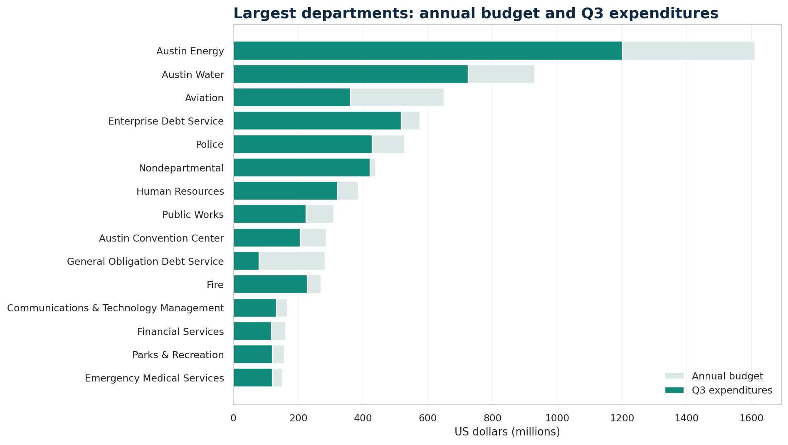
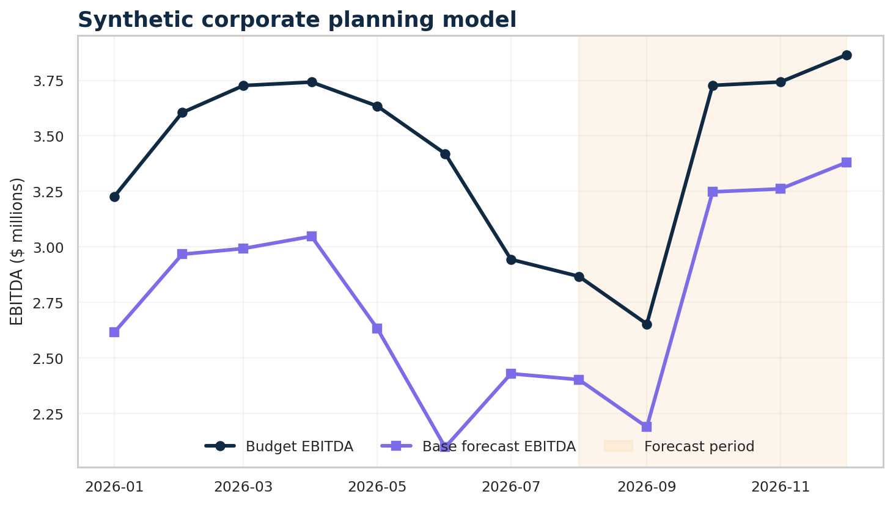

# 06 · Financial Planning & Variance Command Center

## Business question

Where should finance leaders focus budget reviews after Q3, which variance
signals require context, and how can a planning team test the financial effect
of revenue, cost, and hiring assumptions?

**Stakeholders:** finance leadership, budget owners, department leaders, and
FP&A analysts.

## Why this project exists

The first five portfolio projects cover predictive modeling, forecasting,
experimentation, SQL, customer analytics, and marketing activation. Project 06
adds a distinct analyst workflow:

- budget-versus-actual reconciliation;
- department, fund, program, and expense-driver analysis;
- pacing and run-rate proxies with clear accounting boundaries;
- a formula-driven Excel planning workbook;
- a clearly labeled corporate scenario model;
- Streamlit and Power BI delivery assets.

## Hybrid design

### Real public-finance analysis

The primary analysis uses the current City of Austin FY2026 Operating Budget Vs
Expense dataset: 57,267 public records through Q3 across 40 departments, 156
funds, and 196 programs. See [DATA_SOURCE.md](DATA_SOURCE.md).

### Synthetic corporate planning lab

Public municipal data do not contain corporate revenue, COGS, EBITDA, or hiring
plans. A separate seeded hypothetical software-company model demonstrates those
concepts without pretending that synthetic figures are real. It remains visibly
labeled in every deliverable.

## Key findings

- **$8.102B** annual budget and **$6.021B** of Q3 expenditures.
- **74.32%** utilization versus a **75%** elapsed-time benchmark.
- **-$55.25M** citywide pace variance relative to that benchmark.
- Six departments more than five percentage points above pace.
- **$435.2M** of positive spend appears on zero-budget source lines; the City
  documents important wage/leave allocation reasons, so these are review items
  rather than automatic overruns.
- Austin Energy is the largest department budget at **$1.611B** and is near pace
  at approximately **74.58%** utilization.

See [insights.md](insights.md) for the decision brief.

## Analytical method

For the FY2026 Q3 snapshot:

```text
expected spend to date = annual budget × 75%
pace variance = expenditures − expected spend to date
linear run-rate proxy = expenditures ÷ 75%
projected variance proxy = linear run rate − annual budget
```

The words *proxy* and *pace* are intentional. Spending is not necessarily
linear, and these metrics are screening tools—not audited forecasts.

## Deliverables

- `build_finance.py` — deterministic public and corporate output builder;
- `assets/project_06_fpa_model.xlsx` — nine-sheet, formula-driven Excel model;
- `pages/6_Financial_Planning.py` — interactive command center;
- `power-bi/` — theme, DAX measures, Desktop guide, and validation checklist;
- `outputs/` — reviewed dashboard-ready CSVs committed for deployment;
- automated tests for schema, reconciliation, scenarios, and source handling.

## Excel workbook

The workbook contains:

1. Read Me and methodology;
2. Austin executive dashboard;
3. department and fund summaries;
4. ranked variance drivers;
5. data-quality reconciliation;
6. editable scenario assumptions;
7. formula-driven corporate plan;
8. corporate dashboard.

Change the three yellow assumption cells to recalculate the corporate scenario.
The workbook uses modern `.xlsx`; no macros or external connections are needed.

## Reproduce

From the repository root in Windows PowerShell:

```powershell
pip install -r requirements-dev.txt
python .\06-financial-planning\download_data.py
python .\06-financial-planning\build_finance.py
python .\06-financial-planning\build_excel.py
python .\06-financial-planning\render_assets.py
python -m pytest -q
python -m streamlit run streamlit_app.py
```

The 15.7 MB source CSV is ignored by Git. Reviewed aggregates, screenshots, and
the Excel workbook are committed for reliable deployment.

## Power BI boundary

The repository includes Power BI-ready data, a theme, reviewed DAX, a build
guide, and a reproducible layout target. It does not claim an unvalidated
`.pbix`; that binary should be added only after official Power BI Desktop
refresh and reconciliation.

## Interview discussion points

1. **Why use 75% as the benchmark?** The source is through Q3. It is a simple
   screening baseline, not a claim that spend should be linear.
2. **Why retain zero-budget spend?** The City explicitly documents accounting
   allocation effects—especially wage and leave objects. Deleting those lines
   would break reconciliation.
3. **Why add synthetic corporate data?** It demonstrates revenue, COGS, EBITDA,
   and scenario skills absent from municipal data while keeping the boundary
   transparent.
4. **What would improve the forecast?** Monthly actuals, encumbrances, payment
   schedules, vacancies, owner estimates, and known one-time commitments.
5. **What is the strongest control?** Every dashboard total reconciles to
   reviewed outputs, and public and synthetic data never share a metric.




