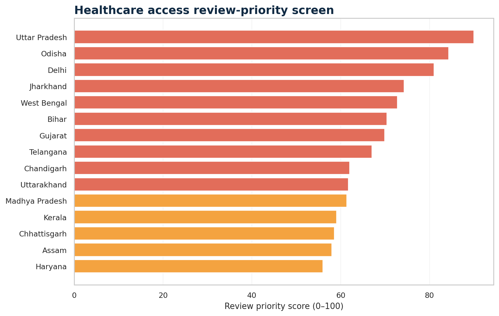
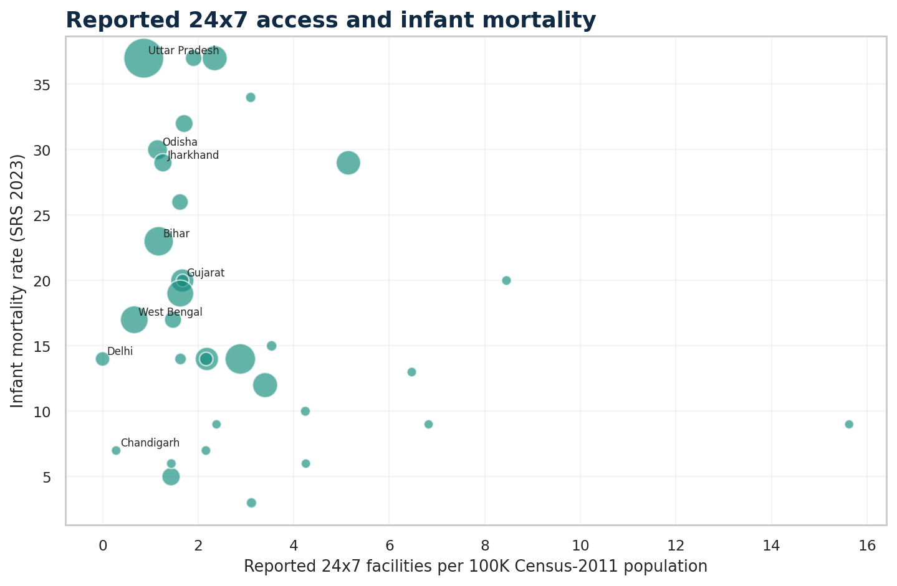

# 07 · India Healthcare Access & Readiness Command Center

## Business question

Where should National Health Mission programme managers focus access and
readiness review, and which apparent gaps are actually data-quality issues?

**Stakeholders:** public-health programme managers, state review teams,
health-system planners, and monitoring/evaluation analysts.

## Method

1. Download official NHM quarterly MIS PDFs.
2. Parse 24 reviewed indicators for all 36 states/UTs with `pdfplumber`.
3. Model access, staffing, mapping, and outcome metrics in DuckDB SQL.
4. Preserve missing, zero, and over-100% source inconsistencies.
5. Build a completeness-aware review-priority screen requiring at least three
   of four components.
6. Deliver reviewed outputs in Streamlit and Power BI companion formats.

## Key results

- 183,562 sub-centres, 26,309 PHCs, 6,388 CHCs, 784 district hospitals, and
  23,187 reported 24x7 facilities.
- 42.6% median PHC three-nurse readiness.
- 14.5 median reported IMR across states/UTs.
- Ten states/UTs in the higher review-priority quartile.
- Two missing/zero population records prevent safe per-capita calculations.

The priority score is a screening tool, not a funding allocation, causal model,
or clinical-quality ranking. See [DATA_SOURCE.md](DATA_SOURCE.md).

## Reproduce

```powershell
pip install -r requirements-dev.txt
python .\07-healthcare-access\download_data.py
python .\07-healthcare-access\build_healthcare.py
python .\07-healthcare-access\render_assets.py
python -m pytest -q
python -m streamlit run streamlit_app.py
```

Raw PDFs and the local DuckDB database are ignored by Git. Reviewed aggregates
and dashboard assets are committed for reliable deployment.

## Deliverables

- five-tab Streamlit healthcare command center;
- DuckDB SQL healthcare access mart;
- source and data-quality reconciliation;
- review-priority audience export;
- Power BI theme, DAX measures, build guide, and layout target;
- automated parser, schema, filtering, priority, and smoke tests.




